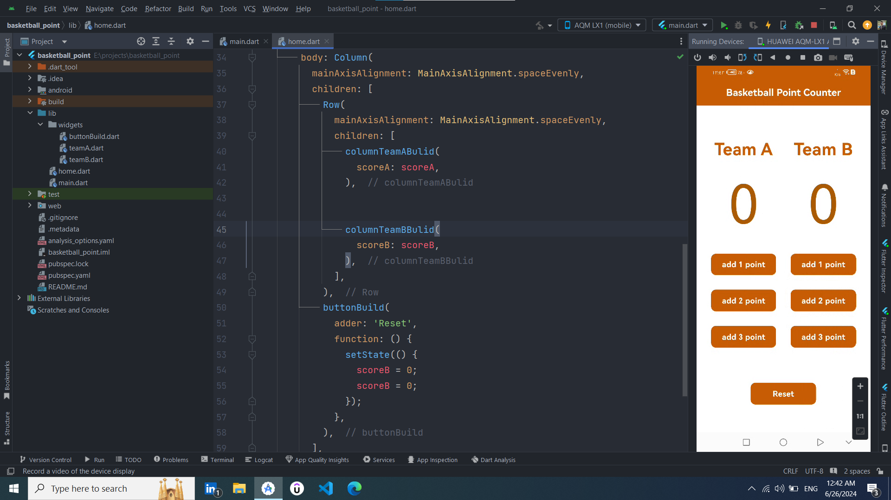

# Basketball Point Counter App

This is a simple basketball point counter mobile application built using Flutter. It allows users to keep track of scores for two teams during a basketball game.

## Features

- **Score Counting**: Easily add points for each team with intuitive buttons.
- **Reset**: Reset the scores for both teams to zero.
- **Simple and Intuitive**: Designed to be straightforward and easy to use.

## Screenshots

## Demo

Here's a short demo of the app:

<video width="320" height="240" controls>
  <source src="assets/basketball point.mp4" type="video/mp4">
  Your browser does not support the video tag.
</video>

## Getting Started

### Prerequisites

Make sure you have Flutter installed. If not, you can [install Flutter](https://flutter.dev/docs/get-started/install) from the official website.

### Installation

1. Clone the repository from GitHub:
git clone https://github.com/your-username/basketball-point-counter-app.git

2. Navigate into the project directory:
cd basketball-point-counter-app

3. Get the dependencies:
flutter pub get

### Usage

1. Connect your mobile device or start an emulator.
2. Run the application:
flutter run

3. Use the app to add points to each team as needed during a basketball game.

### How to Contribute

Contributions are welcome! Here's how you can contribute to this project:

1. Fork the project repository.
2. Create a new branch (`git checkout -b feature/new-feature`).
3. Make your changes.
4. Commit your changes (`git commit -am 'Add new feature'`).
5. Push to the branch (`git push origin feature/new-feature`).
6. Create a new Pull Request.

### License

This project is licensed under the MIT License - see the [LICENSE](LICENSE) file for details.

### Acknowledgments

- This project was inspired by the need for a simple, easy-to-use basketball scoring app.

## Contact

If you have any questions or suggestions about this project, feel free to contact me at mohammedmego15@gmail.com.